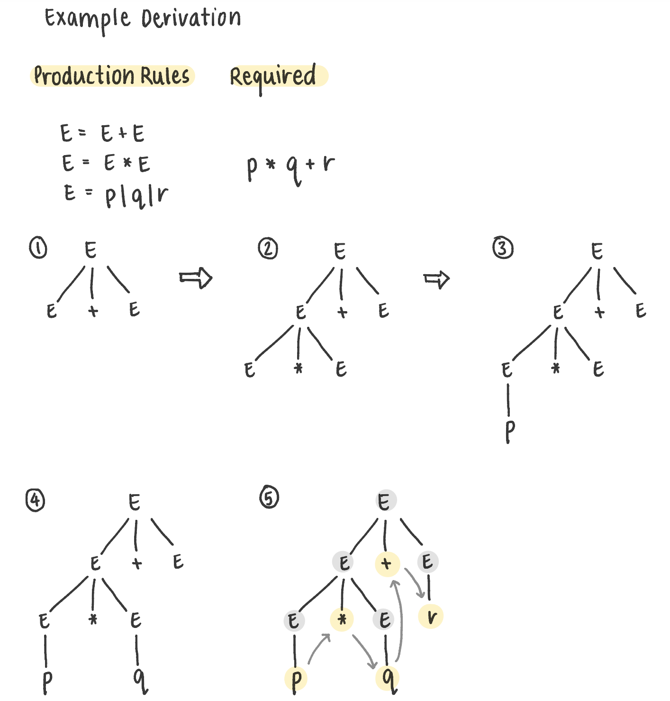

### Procedure

# Experiments

### Reading Parse Trees

For a given derivation tree, Imagine you are traversing a tree using depth-first search (in the order: `dfs(leftmost_child),… dfs(rightmost_child)`. Then, keep track of all the terminal nodes you come across in this process. 

### Example

Construct a parse tree for `p*q+r`, given the following production rules-

```jsx
    E = E + E  
    E = E * E  
    E = p | q | r
```

The construction process is as follows:



$p*q+r$

### **Ambiguity in CFGs**

Ambiguous CFGs refer to context-free grammars where there exist more than one derivation tree for a given input string. This implies that there can exist multiple Left Most Derivation Trees or Right Most Derivation Trees for a single input. Ambiguity in grammars can be removed by re-writing the grammar without ambiguity, as there is no method to automatically detect and remove it. 

### Experiment 1

Construct a derivation tree for the string `aabbabba` for the CFG given by - 

```jsx
    S → aB | bA  
    A → a | aS | bAA  
    B → b | bS | aBB
```

The derivation tree: 


aabbabba

### Experiment 2

Show the derivation tree for string "`aabbbb`" with the following grammar - 

```jsx
    S → AB | ε  
    A → aB  
    B → Sb
```

The derivation tree: 


aabbbb